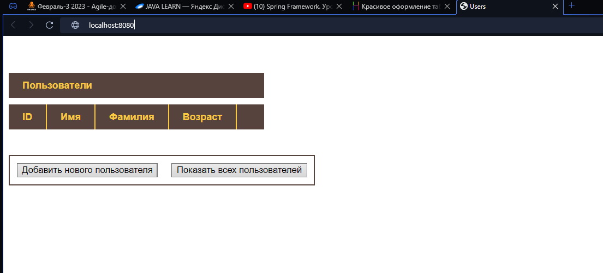
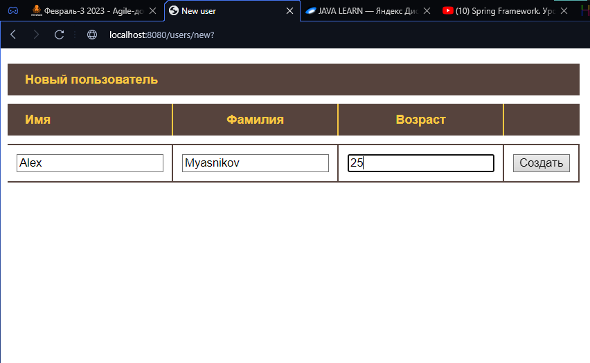

Задание:

Написать CRUD-приложение. Использовать Spring MVC + Hibernate.

Должен быть класс {{User }}с произвольными полями (id, name и т.п.).

В приложении должна быть страница, на которую выводятся все юзеры с возможностью добавлять, удалять и изменять юзера.

Конфигурация Spring через {{JavaConfig }}и аннотации, по аналогии с предыдущими проектами. Без использования xml. Без Spring Boot.

Внесите изменения в конфигурацию для работы с базой данных. Вместо SessionFactory должен использоваться EntityManager.

